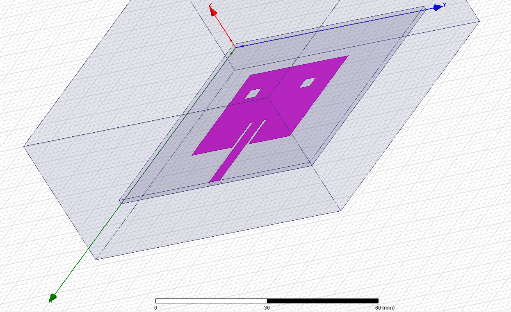

# Ultrawide-Band-Antenna-Design
This is the term project for the Antennas course, an UWB microstrip patch antenna.

  

[Source for this photogenic antenna.](https://www.taoglas.com/product/gp-1575-25-4-a-02-gps-1575-42mhz-patch-antenna-254mm-2/) What a shot actually.

The [pdf file](https://github.com/kantarcise/Ultrawide-Band-Antenna-Design/blob/master/Project.pdf) contains the report.

The project file for HFSS can be found [here.](https://github.com/kantarcise/Ultrawide-Band-Antenna-Design/blob/master/TermProject.hfss)

HFSS is fun, just a bit scary to learn at first =) { Youtube is your biggest friend here. [Example 1](https://www.youtube.com/watch?v=dK16nBUjlMw) , [Example 2](https://www.youtube.com/watch?v=jPrK68hDL5c) }

## Introduction

This project started off as a UWB design, but turned to a little disaster. Hopefully saved with a little tweak at the end though.

First off all, the reference design was [this paper from IJRTE.](https://www.ijrte.org/wp-content/uploads/papers/v8i1/A1959058119.pdf) 
This design claimed a simulation for a dual band patch antenna, with a kinda basic geometry. Only 2 slots were taken out of the regular 
patch shape, and a generic feeding line structure.

But boy i was wrong. 

However, I tried to simulate the exact shape of the antenna (the design from the paper) and developed the project on HFSS initially.  

## Design

HFSS 15.0 was the choice of software for the simulation. (Easy to access & use, a lot of tutorials on it.) A lossy material; FR4 is used as substrate on the antenna material.

All the specific lengths and width on the design can be found on the report. But the general look of it can be seen down below.

  

## Results and Future Work

Well the result for the designed project is just literally wrong. That is not an Ultra wide Band antenna. It is a really good antenna in 
terms of gain, but not wide band.

On a bright side, like reported in results part, with some tweaks on ground; we can make it a little bit wider band antenna.

## References

All the references are listed here, if you want to check them out.

[1] Microstrip Patch Antenna Calculator link: http://www.emtalk.com/mpacalc.php

[2] **Soundarya S., Meghana S., Shanthi P. "Design of Dual Band Micro Strip Antenna for
2.4 GHz and 3.6 GHz"**, International Journal of Recent Technology and Engineering (IJRTE), ISSN: 2277-3878, Volume-8, Issue-1, May 2019
link : https://www.ijrte.org/wp-content/uploads/papers/v8i1/A1959058119.pdf

## Help, I don't understand this!

For any questions regarding how to use HFSS, how to search for a design to get a reference to evaluate; feel free to contact [Sezai](mailto:sezaiburakkantarci@gmail.com) from the mail. 
