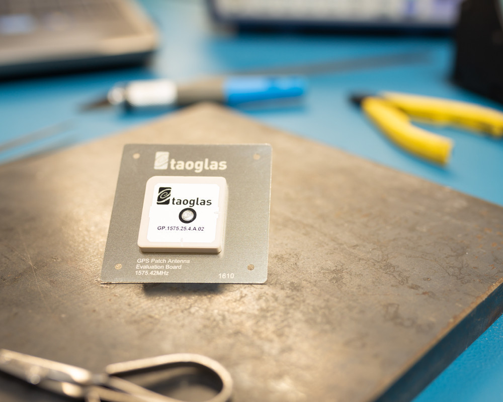

# Ultrawide-Band-Antenna-Design
This is the term project for the Antennas course, an UWB microstrip patch antenna.

  

[Source](https://www.taoglas.com/product/gp-1575-25-4-a-02-gps-1575-42mhz-patch-antenna-254mm-2/)

